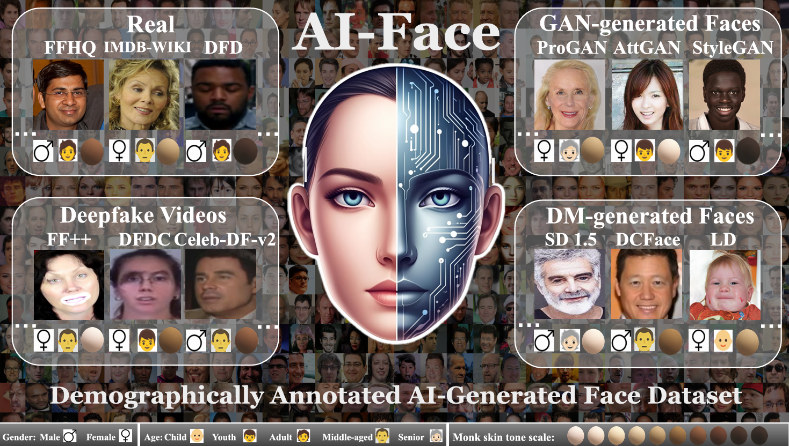

[](https://creativecommons.org/licenses/by-nc/4.0/)   

# AI-Face-FairnessBench
This repository is the official implementation of our paper [AI-Face: A Million-Scale Demographically Annotated AI-Generated Face Dataset and Fairness Benchmark](https://arxiv.org/abs/2406.00783)

🎉🎉🎉 **Our AI-Face has been accepted by CVPR 2025!**
<figure>
  
</figure>

Welcome to our work **AI-Face**, for fairness benchmark in AI-generated face detection. 

**In this work, we propose: (1) a **million-scale demographically annotated** with 37 distinct generations methods; and (2) a **comprehensive fairness benchmark** for training, evaluation, and analysis.**

**AI-Face Dataset Highlight:** The key features of our proposed **AI-Face dataset** are as follows

✅ **Demographic Annotation**: *AI-Face* provides Skin Tone, Gender, Age annotations, which are highly salient to measuring bias.

✅ **Forgery Diversity**: *AI-Face* comprises **37** distinct deepfake techniques from Deepfake Vidoes, GAN, and Diffusion Models (both representive and SOTA methods are included), facilitating the detection of nowadays' SOTA deepfakes and AIGCs.

✅ **Forgery Scale**: *AI-Face* offers **million-level** AI-generated data scale for face image.

## License
The AI-Face Dataset is licensed under [CC BY-NC-ND 4.0](https://creativecommons.org/licenses/by-nc-nd/4.0/legalcode)

## Download
If you would like to access the AI-Face Dataset, please download and sign the [EULA](https://drive.google.com/file/d/1uiAuNHvYmn1kggVCaDmFbndESlGyMN-X/view?usp=sharing). Please upload the signed EULA to the [Google Form](https://forms.gle/Wci1hsZCz6Rgnvw57) and fill the required details. Once the form is approved, the download link will be sent to you.
If you have any questions, please send an email to lin1785@purdue.edu, hu968@purdue.edu

## 1. Installation

You can run the following script to configure the necessary environment:

```
cd AI-Face-FairnessBench
conda create -n FairnessBench python=3.9.0
conda activate FairnessBench
pip install -r requirements.txt
```
## 2. Dataset Preparation and Description
After getting our AI-Face dataset, put the provided `train.csv` and `test.csv` within AI-Face dataset under  [`./dataset`](./dataset).

train.csv and test.csv is formatted:

| Column                     | Description                                                         |
|----------------------------|---------------------------------------------------------------------|
| Image Path                 | Path to the image file                                              |
| Gender                     | Gender label: 1 - Male, 0 - Female                                  |
| Age                        | Age label: 0 - Child, 1 - Youth, 3 - Adult, 4 - Middle-aged, 5-Senior|
| Skin Tone                  | Skin Tone label: Monk Skin Tone Scale             |
| Intersection               | 0-(Male,Light), 1-(Male,Medium), 2-(Male,Dark), 3-(Female,Light), 4-(Female,Medium), 5-(Female,Dark)|
| Target                     | Label indicating real (0) or fake (1) image                         |

### Instructions

1. Download `part1.tar` and `part2.tar`.
2. Untar both files.
3. Organize the data as shown below:
   
```
AI-Face Dataset
  ├── AttGAN
  ├── Latent_Diffusion
  ├── Palette
  ├── ...
  ├── ...
```

## 3. Load Pretrained Weights
Before running the training code, make sure you load the pre-trained weights. You can download *Xception* model trained on ImageNet (through this [link](https://purdue0-my.sharepoint.com/:f:/g/personal/lin1785_purdue_edu/Ev9aYYYBI5dGoKq_ib2FnbYBWM9un-dpLBX9UwfedInMSQ?e=A2nqXO)).

## 4. Train
To run the training code, you should first go to the [`./training/`](./training/) folder, then run [`train_test.py`](training/train_test.py):

```
cd training

python train_test.py 
```

You can adjust the parameters in [`train_test.py`](training/train_test.py) to specify the parameters, *e.g.,* model, batchsize, learning rate, *etc*.

`--lr`: learning rate, default is 0.0005. 

`--train_batchsize`: batchsize for training, default is 128.

`--test_batchsize`: batchsize for testing, default is 32.

` --datapath`: /path/to/[`dataset`](./dataset).

`--model`: detector name ['xception', 'efficientnet', 'core', 'ucf', 'srm', 'f3net', 'spsl', 'daw_fdd', 'dag_fdd', 'fair_df_detector'], default is 'xception'.

`--dataset_type`: dataset type loaded for detectors, default is 'no_pair'. For 'ucf' and 'fair_df_detector', it should be 'pair'. 

#### 📝 Note
To train ViT-b/16 and UnivFD, please run  [`train_test_vit.py`](training/train_test_vit.py) and [`train_test_clip.py`](training/train_test_clip.py), respectively.

## 📦 Provided Detectors
|                  | File name                               | Paper                                                                                                                                                                                                                                                                                                                                                         |
|------------------|-----------------------------------------|---------------------------------------------------------------------------------------------------------------------------------------------------------------------------------------------------------------------------------------------------------------------------------------------------------------------------------------------------------------|
| Xception          | [xception_detector.py](./training/detectors/xception_detector.py)         | [Xception: Deep learning with depthwise separable convolutions](https://openaccess.thecvf.com/content_cvpr_2017/html/Chollet_Xception_Deep_Learning_CVPR_2017_paper.html) |
| EfficientNet-B4            | [efficientnetb4_detector.py](./training/detectors/xception_detector.py)       |  [Efficientnet: Rethinking model scaling for convolutional neural networks](http://proceedings.mlr.press/v97/tan19a.html)                                                                                                                                                                                                                                                                                              |
| ViT-B/16      |  [train_test_vit.py](./training/train_test_vit.py) | [An Image is Worth 16x16 Words: Transformers for Image Recognition at Scale](https://arxiv.org/abs/2010.11929)                                                                                                                                                                                                                  |
| UCF      | [ucf_detector.py](./training/detectors/ucf_detector.py) | [UCF: Uncovering Common Features for Generalizable Deepfake Detection](https://openaccess.thecvf.com/content/ICCV2023/papers/Yan_UCF_Uncovering_Common_Features_for_Generalizable_Deepfake_Detection_ICCV_2023_paper.pdf) |
| UnivFD    |  [train_test_clip.py](./training/train_test_clip.py) | [Towards Universal Fake Image Detectors that Generalize Across Generative Models](https://openaccess.thecvf.com/content/CVPR2023/papers/Ojha_Towards_Universal_Fake_Image_Detectors_That_Generalize_Across_Generative_Models_CVPR_2023_paper.pdf) | 
| CORE    |  [core_detector.py](./training/detectors/core_detector.py) | [CORE: Consistent Representation Learning for Face Forgery Detection](https://openaccess.thecvf.com/content/CVPR2022W/WMF/papers/Ni_CORE_COnsistent_REpresentation_Learning_for_Face_Forgery_Detection_CVPRW_2022_paper.pdf) |  
| F3Net    |  [f3net_detector.py](./training/detectors/f3net_detector.py) | [Thinking in Frequency: Face Forgery Detection by Mining Frequency-aware Clues](https://www.ecva.net/papers/eccv_2020/papers_ECCV/papers/123570086.pdf) | 
| SRM    |  [srm_detector.py](./training/detectors/srm_detector.py) | [Generalizing Face Forgery Detection with High-frequency Features](https://openaccess.thecvf.com/content/CVPR2021/papers/Luo_Generalizing_Face_Forgery_Detection_With_High-Frequency_Features_CVPR_2021_paper.pdf) | 
| SPSL    |  [spsl_detector.py](./training/detectors/spsl_detector.py) | [Spatial-Phase Shallow Learning: Rethinking Face Forgery Detection in Frequency Domain](https://arxiv.org/abs/2103.01856) | 
| DAW-FDD    |  [daw_fdd.py](./training/detectors/daw_fdd.py) | [Improving Fairness in Deepfake Detection](https://openaccess.thecvf.com/content/WACV2024/papers/Ju_Improving_Fairness_in_Deepfake_Detection_WACV_2024_paper.pdf) | 
| DAG-FDD    |  [dag_fdd.py](./training/detectors/dag_fdd.py) | [Improving Fairness in Deepfake Detection](https://openaccess.thecvf.com/content/WACV2024/papers/Ju_Improving_Fairness_in_Deepfake_Detection_WACV_2024_paper.pdf) | 
| PG-FDD    |  [fair_df_detector.py](./training/detectors/fair_df_detector.py) | [Preserving Fairness Generalization in Deepfake Detection](https://arxiv.org/abs/2402.17229) | 

## 🚀 Checkpoints
Checkpoints of detectors trained on our AI-Face can be downloaded through the [link](https://purdue0-my.sharepoint.com/:f:/g/personal/lin1785_purdue_edu/EsNU0g9QQP5Dgf74rgmydfoB-gWRy2zRpqnuE8sONgQ5mw?e=1wvy2j).

## 📢 Update Notes:
This is our second version of the dataset; here, we list the key differences between the first version. For more details on the initial version, refer to our [paper](https://arxiv.org/pdf/2406.00783v2).
1. Annotation Difference. We have Gender, Age, and Race categories in the first version. See the [updated annotations](#2-dataset-preparation-and-description) in the second version.
   
| Column                     | Description                                                         |
|----------------------------|---------------------------------------------------------------------|
| Image Path                 | Path to the image file                                              |
| Uncertainty Score Gender   | Uncertainty score for gender annotation                             |
| Uncertainty Score Age      | Uncertainty score for age annotation                                |
| Uncertainty Score Race     | Uncertainty score for race annotation                               |
| Ground Truth Gender        | Gender label: 1 - Male, 0 - Female                                  |
| Ground Truth Age           | Age label: 0 - Young, 1 - Middle-aged, 2 - Senior, 3 - Others       |
| Ground Truth Race          | Race label: 0 - Asian, 1 - White, 2 - Black, 3 - Others             |
| Intersection               |  0-(Male,Asian), 1-(Male,White), 2-(Male,Black), 3-(Male,Others), 4-(Female,Asian), 5-(Female,White), 6-(Female,Black), 7-(Female,Others)|
| Target                     | Label indicating real (0) or fake (1) image                         |

2. We used [VGGFace2](https://www.robots.ox.ac.uk/~vgg/data/vgg_face2/) for annotator training in the first version, while [IMDB-WIKI](https://data.vision.ee.ethz.ch/cvl/rrothe/imdb-wiki/), the gender and age labels from IMDB-WIKI were crawled from Wikipedia and IMDb website, which makes sure the label quality is higher and more reliable.

3. The difference in the subsets of different versions of AI-Face includes:
   
| **Category**                  | **AI-Face v1** | **AI-Face v2** |
|--------------------------------|---------------|---------------|
| **Deepfake Video Datasets**    | FF++, DFDC, DFC, Celeb-DF-v2 | FF++, DFDC, DFD, Celeb-DF-v2 |
| **GAN Models (10 total)**      | AttGAN, MMDGAN, StarGAN, StyleGANs, MSGGAN, ProGAN, STGAN, VQGAN | AttGAN, MMDGAN, StarGAN, StyleGANs, MSGGAN, ProGAN, STGAN, VQGAN |
| **DM Models (8 total)**        | DALLE2, IF, Midjourney, DCFace, Latent Diffusion, Palette, Stable Diffusion v1.5, Stable Diffusion Inpainting | DALLE2, IF, Midjourney, DCFace, Latent Diffusion, Palette, Stable Diffusion v1.5, Stable Diffusion Inpainting |
| **Fake Face Images**           | 1,245,660 | 1,245,660 |
| **Real Source Datasets**       | **FFHQ, CASIA-WebFace, IMDB-WIKI, CelebA, real images from FF++, DFDC, DFD, Celeb-DF-v2** | **FFHQ, IMDB-WIKI, real images from FF++, DFDC, DFD, Celeb-DF-v2** |
| **Total Real Face Images**     | **866,096** | **400,885** |
| **Total Subsets**              | **30** | **28** |
| **Generation Methods**         | 5 in FF++, 5 in DFD, 8 in DFDC, 1 in A-Celeb-DF-v2, 10 GANs, 8 DMs | 5 in FF++, 5 in DFD, 8 in DFDC, 1 in Celeb-DF-v2, 10 GANs, 8 DMs |


If you use the AI-face dataset in your research, please cite our paper as:

```bash
@inproceedings{lin2025aiface,
  title={AI-Face: A Million-Scale Demographically Annotated AI-Generated Face Dataset and Fairness Benchmark},
  author={Li Lin and Santosh and Mingyang Wu and Xin Wang and Shu Hu},
  booktitle={Proceedings of the IEEE/CVF Conference on Computer Vision and Pattern Recognition (CVPR)},
  year={2025}
}
```
